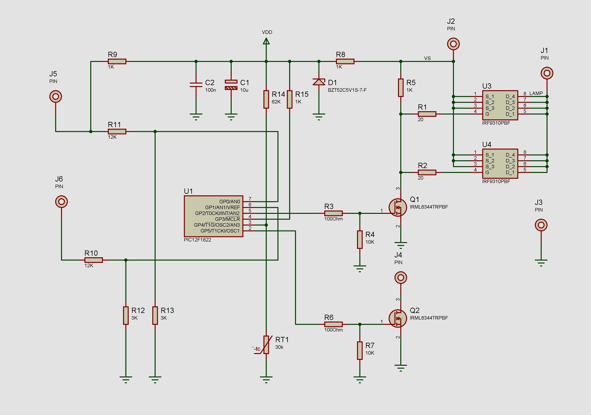

# PICDRL
Day running light controller on PIC12F1288 MCU
Контроллер дневных ходовых огней

Умеет включать дневные ходовые огни по изменению бортового напряжения питания (таким способом обеспечивается детекция запуска двигателя).
Есть дополнительных выход для включения реле управляющего включением дополнительного оборудования после запуска двигателя.
Напряжения включения и  заполнение ШИМ выставляется конфигурацией в файле.

